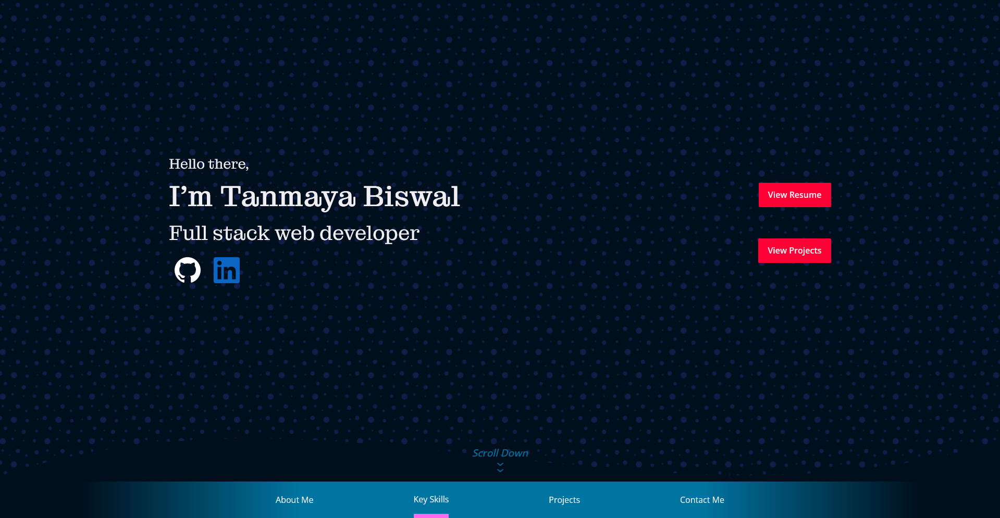

# **Portfolio of Tanmaya Biswal**

This single page app, made in React, is about Tanmaya which means it about me! The page has most of my contact information if you want to reach out to me. I will be happy to have a chat with you.

Besides my contact info, the page also contains links to some of my standout projects that I have worked on and you can also check out their source code if you are interested. I have clearly labelled all of my key skills and tools that I tend to use while I am building a web app. 

I hope you like visiting my page, I welcome you to share any thoughts you have on the portfolio design; the good, the bad and the ugly. Feedbacks are key to improving afterall!

 (*But I think the page turned out prettttttyyyy good if I say so myself haha.*) 

#

### *`Do not know why would want to build my portfolio on your machine, but here goes -->`*

### `npm install`

After downloading the files to your local machine, this command installs all the dependencies related to the app.

### `npm start`

After the dependencies have install, this command runs the app in the development mode.\
Open [http://localhost:3000/tanmaya-portfolio](http://localhost:3000/tanmaya-portfolio) to view it in your browser.

The page will reload when you make changes.

### `npm run build`

Builds the app for production to the `build` folder.\
It correctly bundles React in production mode and optimizes the build for the best performance.

The build is minified and the filenames include the hashes.

See the section about [deployment](https://facebook.github.io/create-react-app/docs/deployment) for more information.

